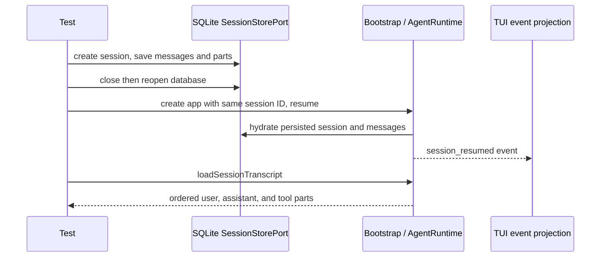

# Terminal event and session verification

This verification contract supplements `cli-tui-spec.md`; it does not change the runtime or storage contract.

## Owners and boundaries

- `AgentRuntime` owns the active session and resume lifecycle. The existing SQLite `SessionStorePort` owns persisted session/message/part records.
- The CLI event relay forwards events from the current runtime. The TUI event adapter owns only the transcript projection and status fields.
- Tests use a temporary SQLite database and the production `ProviderRegistry`, bootstrap app, event constructors, and TUI reducers. They do not call external providers or mutate a user's config/history.
- Production package public entrypoints supply cross-package runtime and storage dependencies. TUI tests may exercise their own package's event adapter directly.

## Acceptance cases

1. Persisted sessions survive close/reopen, list only roots when requested, and `resolveLatestSession` respects the workspace directory.
2. A resumed app keeps the selected session ID, reconstructs persisted user/assistant/tool transcript, and emits the real `SessionResumed` lifecycle event without invoking a model.
3. A missing session fails resume without inventing a session or transcript.
4. Re-saving an existing part updates it once rather than duplicating it after cold load.
5. Text deltas become visible before completion; final completion does not duplicate streamed text. Tool scheduled/running/result/error events update the same tool card in order. Failure events expose a visible error, and resume clears stale queued projection.
6. The resident CLI event relay follows `/new` and `/resume` app replacement: the old runtime is detached before the current runtime is subscribed, and the final sink removal detaches the subscription.
7. Tests isolate storage and configs under a newly allocated temporary directory and clean it after all real app/store resources close.

These cases prove storage/resume and event-adapter behavior. They do not claim that a real remote model/tool request, terminal rendering, keyboard cancellation, or terminal cleanup has passed.
