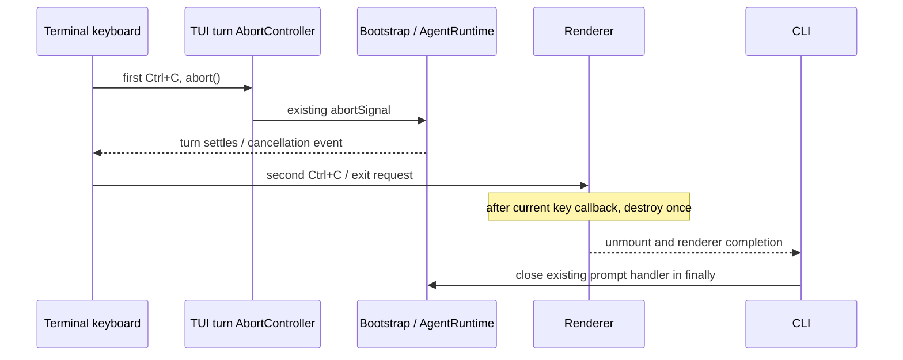

# Terminal cancellation and cleanup

The terminal adapter owns the key gesture and exit confirmation. The existing
turn AbortController owns cancellation delivery; bootstrap/runtime remain the
only owners of accepted input and task execution. Renderer owns raw mode,
alternate screen, cursor and native terminal resources.

## Rules

- Ctrl+C with selected text copies the selection and resets exit confirmation.
- While a foreground turn is active, the first Ctrl+C aborts that turn, retains
  any unsubmitted draft, and arms the existing two-second exit confirmation.
  A second Ctrl+C in that window exits, whether cancellation is still settling
  or the runtime already returned idle. Waiting past that window requires a
  fresh confirmation. A different key resets the confirmation.
- Cancellation remains reachable while an approval or picker is visible.
  Abort listeners in existing permission/selection adapters resolve their state;
  keyboard handling must not maintain a second cancellation queue.
- While idle, Ctrl+C clears a nonempty draft. With an empty draft it first shows
  the exit hint and requires confirmation. Esc keeps its existing cancel rule.
- Renderer destruction is requested once and deferred until the current input
  callback returns. This avoids destroying the native input/render stack while
  it is still processing the exit key. Startup/render failures restore terminal
  resources before propagating to the CLI error boundary.
- Normal exit unmounts React, detaches listeners and closes the CLI app through
  the existing finally block. There is no change to desktop/mobile protocols,
  persistence, session ownership or accepted input semantics.

## Acceptance

Native OpenTUI keyboard tests exercise cancellation during a turn, draft
preservation, a second Ctrl+C exit, idle draft clearing and confirmation. They
observe the actual signal supplied to submitPrompt rather than only callback
ordering. Startup failure tests assert destroyed renderer and listener cleanup.
Runtime/model cancellation verification must additionally prove that the same
signal reaches real AgentRuntime execution. Terminal visual correctness and
Windows encoding require separate rendered/manual evidence; lifecycle tests
alone do not establish readability.
