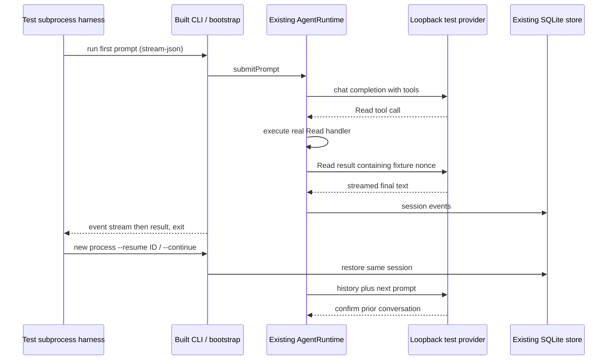

# CLI runtime smoke acceptance

The subprocess smoke uses the built CLI and its normal bootstrap, provider registry,
Agent runtime, Read tool and SQLite session store. A loopback HTTP fixture implements
OpenAI chat-completions SSE. This deterministic test provider is not an external
model; passing it proves integration and persistence, not external service availability
or model reasoning quality.

The fixture owns only HTTP responses and assertions. The Agent runtime remains the
single owner of turn admission, tool calls, session IDs and persistence. Every child
uses a fresh temporary home, config, credential root, log directory and database.
User configuration and credentials are never copied into the fixture.



The tool-loop case requires a real file Read result reaching the second HTTP
request. The session case checks first-session creation and verifies prior
conversation history in both explicitly resumed and latest-session continuation
requests from new processes.

Cancellation has two separate evidence scopes. The built CLI child test confirms
an active HTTP request before SIGINT and then requires the child to exit. On
Windows, Node child-process signal delivery can terminate the process directly;
this subprocess case alone does not prove graceful AgentRuntime cancellation.

The source entrypoint case injects only the signal emitter and exit callback into
`run.ts`. It uses the real `createZCodeApp`, ProviderRegistry and loopback model
request. After the model request arrives, the injected SIGINT invokes the actual
CLI shutdown handler. The observed outcome is a nonzero run result, an exit
callback with code 130, and `Turn was cancelled.` on stderr. This case provides
the AbortSignal and cleanup evidence without depending on Windows OS signal
delivery semantics.

The provider is deterministic and local. These tests do not establish external
model availability, provider quality, or interactive terminal rendering.

Run after building `@zcode/cli`:

```sh
node --test apps/zcode-cli/packages/cli/test/runtime-smoke.test.mjs
```
