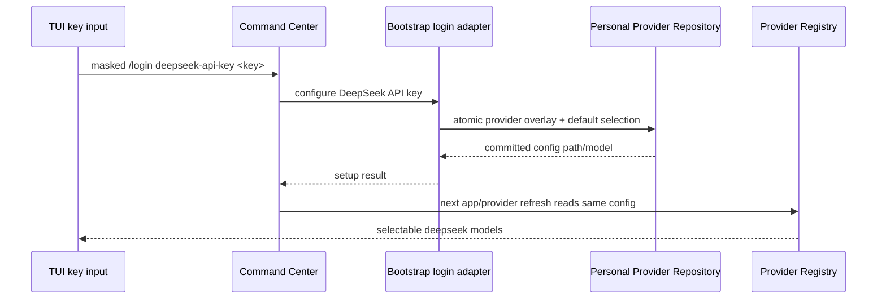

# Terminal frontend contract

## Ownership and compatibility

CLI and TUI remain adapters to the existing bootstrap app. Core owns session,
model, tool execution, admission, cancellation, and persistence. CLI owns argument
interpretation and output; TUI owns presentation and editing. No new runtime or
session store is permitted. Internal search, plugin-host, workflow-child and
app-server commands retain their existing dispatch and arguments.

## CLI routing acceptance

- No arguments opens the existing TUI; `chat` aliases `tui`.
- A positional prompt or `run <prompt>` executes one headless task.
- Options may precede or follow a command/prompt. Option values are never prompt
  words. Node parseArgs is the only global option schema.
- `--` preserves the following text literally, including command names and
  option-looking text. Empty run prompts, missing resume IDs, incompatible
  prompt sources, and extra chat/resume operands produce usage errors before
  loading any model.
- `resume ID` aliases `tui --resume ID`. `--continue` and explicit resume are
  mutually exclusive. Session IDs remain opaque backend identifiers.
- `--help` and `--version` do not contact providers.
- Process startup, logging boundaries, provider initialization, and execution
  classify the same normalized parsed invocation.
- `--no-tui` is an explicit headless guard for prompt/target runs. It never
  opens raw mode or the alternate screen; using it without a prompt/target is a
  usage error rather than an implicit TUI launch.

## Read-only commands

`sessions` reuses listZCodeSessions, with unavailable model metadata labelled
honestly. `models` uses the same prepared provider runtime as prompt/TUI, closes
its runtime on all exits, and emits only non-secret model metadata.
`config` inspects the existing configuration sources and an allowlist of safe
resolved settings. It never dumps MCP commands, environment values, provider
credentials, headers, or hook bodies. JSON is valid even when no models or
sessions exist. Queries do not create conversations.

## Provider setup

The interactive `/login` picker includes DeepSeek API-key setup in addition to
the existing Z.AI and BigModel choices. The key-entry surface masks the key and
does not write the raw command to input history or the transcript. Submitting a
non-empty key sends one `configure-provider-api-key` command to the CLI adapter;
Bootstrap is the sole owner of the personal provider repository and atomically
persists the DeepSeek template overlay plus the default model selection.

The DeepSeek overlay uses the built-in `deepseek` template, so its endpoint and
model metadata remain owned by the built-in provider config. A successful write
must make the same provider registry expose selectable models to `/models` and
`/model` after the current app refreshes or the next TUI starts. Empty keys,
invalid provider names, and repository write failures return an error without
changing the existing config.

Acceptance scenarios:

- `/login` lists a masked DeepSeek API-key option and Enter saves a non-empty key.
- `/login deepseek-api-key <key>` is redacted from history and transcript.
- A fresh `models --json` lists the DeepSeek template models after setup.
- Empty keys and failed writes leave the personal config unchanged.

## Headless input, background completion, and machine output

Headless prompt execution (`-p`/`run`) consumes piped stdin when stdin is not a
TTY. The final prompt text is the non-empty stdin content followed by the
explicit prompt, separated by one blank line. TUI, protocol, query, and login
commands never consume stdin as prompt content. An interactive invocation with
no prompt keeps the existing TUI behavior; a non-interactive terminal receives
an actionable error that points to `-p/--prompt` or a pipe.

Headless runs wait by default for every background task started by the current
process and for notification turns admitted by the same runtime. The CLI
observer owns the started-task IDs and treats every background task kind
(`bash`, `subagent`, and `workflow`) as a trigger. `--no-wait-background` opts
out; when it returns while tasks are still running, it reports their IDs and
returns a non-zero status. `--wait-background` is an explicit spelling of the
default, and the two flags cannot be combined.

`--output-format stream-json` starts with one `type: "session"` header carrying
the session ID, trace ID, CLI version, working directory, and timestamp. Event
lines follow, and the final `type: "result"` line terminates the stream. A
failure emits a structured `type: "result"` line with `isError: true` before
the human-readable stderr diagnostic, so line-oriented callers do not need to
guess whether the process failed before the first event.

Acceptance scenarios:

- `printf 'context' | zcode -p 'review'` submits both pieces in that order;
  `zcode -p 'review'` on a TTY does not wait for stdin.
- A prompt that starts a bash, subagent, or workflow background task waits for
  it and its notification turn before returning by default.
- `--no-wait-background` returns promptly with active task IDs and exit code 1.
- A successful stream begins with one session header and ends with one result;
  a startup or execution error still produces one structured error result.

## GitHub distribution

The repository keeps source and local development commands as the canonical
interface. A GitHub Actions workflow also builds platform-specific Node SEA
executables, which include the CLI and TUI runtime assets in one file. Manual
workflow runs publish downloadable artifacts; pushing a `v*` tag additionally
creates a GitHub Release with the Windows x64, Linux x64, and macOS arm64
archives. The workflow must build on each target operating system so native TUI
and terminal dependencies match the downloaded executable.

Acceptance scenarios:

- A workflow dispatch produces one downloadable executable artifact per target.
- Pushing `v<version>` creates a GitHub Release whose assets launch `zcode
  --help` without a checkout or pnpm workspace.

## Delivery and cancellation

Input -> CLI adapter -> bootstrap app -> AgentRuntime -> SessionEvent ->
headless renderer / TUI state -> terminal. Subscribe once before turn execution,
detach on completion, and dispose resources on all exits. Token deltas render
before completion; final messages cannot repeat streamed text. Tool summaries
are bounded while the backend retains full results. Cancellation uses the
existing AbortSignal; cleanup precedes terminal/process exit. Desktop/mobile
protocol delivery contracts remain unchanged.

## Required verification

Parser tests cover options in either order, every string option, `--`, explicit
-p compatibility, command-word prompts with run, invalid operands, and internal
entrypoint preservation. Tests must isolate storage from real user state.
Session, event adaptation, cancellation, terminal cleanup, and a real model/tool
smoke run remain required for final acceptance. Passing parser tests alone is
not evidence of completion of this specification.

## Terminal-only slash commands

TUI owns `/clear`, `/status`, `/session`, `/exit` and their display effects.
`/clear` clears only the transcript projection while idle; it neither changes
session ID nor writes storage. While a turn runs it asks the user to cancel or
wait, so active streaming parts cannot be orphaned. `/status` reads the existing
model, session getter, workspace, context and usage projection; absent metrics
are unavailable. `/exit` aborts any turn and uses the existing onExit lifecycle.
`/models` delegates to `/model list`; `/sessions` delegates to the existing
`/resume` session picker. Local commands run before input admission and are never
sent to a model or queued as user prompts. Help and completion include these
commands. Tests cover projection-only clear, unknown metrics, delegation, and
abort-before-exit ordering.
